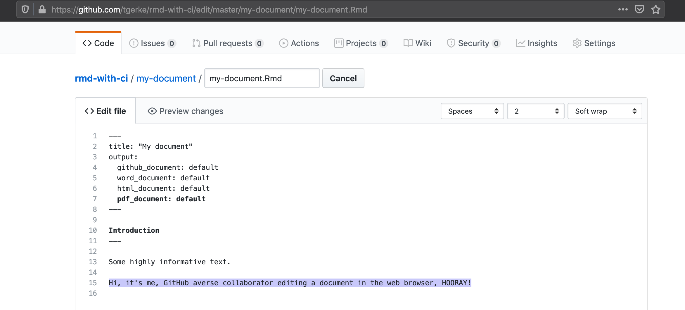

```{r setup, include=FALSE}
options(htmltools.dir.version = FALSE)
knitr::opts_chunk$set(
  fig.width=9, fig.height=3.5, fig.retina=3,
  out.width = "100%",
  cache = FALSE,
  echo = TRUE,
  message = FALSE, 
  warning = FALSE, 
  hiline = TRUE
)
```

name: title
class: left bottom hide-count

<!-- Title Slide -->

<!-- <div class="talk-logo"></div> -->

.talk-meta[
.talk-title[
# `r rmarkdown::metadata$title`

`r rmarkdown::metadata$subtitle`
]

.talk-author[
`r paste(rmarkdown::metadata$author, collapse = " &middot; ")`<br>
.moffitt-gray[`r paste(rmarkdown::metadata$institute, collapse = ", ")`]
]

.talk-date.moffitt-gray[
`r knitr::knit(text = rmarkdown::metadata$date)`
]
]

.talk-logo[]

.title-image[]

```{css echo=FALSE}
/* Define title slide image or logo here */
.talk-logo {
  width: 200px;
  height: 200px;
  position: absolute;
  bottom: 3%;
  right: 2%;
  background-image: url('img/hex-wall.png');
  background-size: contain;
  background-repeat: no-repeat;
  background-position: contain;
}
```

<!-- Moffitt Logo and Slide Border ----

All slides except "title" and "inverse" slides
have the Moffitt Color Bar and logo.

Additional classes are provided to disable both:

- `class: no-logo` hides the logo
- `class: no-border` hides the border

or to force either to be shown

- `class: moffitt-slide-logo` shows the logo
- `class: moffitt-slide-border` shows the border
-->

---
### Some stuff you'll be able to do after this talk

* Automatically render a `.Rmd` file to `.pdf`, `.md`, `.docx`, and `.html` after every edit

--

* Have an R task automatically run at 9pm every day

--

* Make sure jobs work across Windows/Ubuntu/macOS without fiddling with VMs

--

* Other nerd stuff, win arguments about GitHub vs GitLab vs Bitbucket

.h-center.w-30[

]

---
### Rendering a `.Rmd` to multiple formats

* Fact: the git learning curve is steep, so it won't always be possible to perform collaborative document editing "the right way"

  * But you _can_ convince non-git collaborators to edit a document in a web browser (also a useful workflow for convenience, e.g. edits by phone)

.h-center.w-70[

]

---
### Getting browser-based edits into the right format

* Browser editing is fine, but you/consumers need the resulting `.docx`/`.pdf`/`.html`

  * Rendering a `.Rmd` typically requires firing up RStudio, 😢 your browser workflow

--

* But there's a way...

.h-center.w-30[

]

---
### GitHub Actions

* GitHub deploys a virtual machine(s) for your repository to run tasks that you specify

  * A classic use-case is CI/CD to test software across different operating systems; we're going to work through some simpler tasks here

--

* Using GitHub Actions in 5 steps
  1. Create the instruction document in `.github/workflows/my_task.yaml`. 
  <br>.small.moffitt-gray[* Each step below is an edit to `my_task.yaml`]
  2. Specify when you want the action to run
  3. Tell GitHub where you'd like to run the job (Ubuntu, Windows, and/or macOS)
  4. Specify what prebuilt actions you'd like to run before your action
  5. Define your action
  

```{css, echo=FALSE}
.title-image {
  width: 150px;
  height: 150px;
  position: absolute;
  top: 3%;
  left: 2%;
  background-image: url('img/ghactions.png');
  background-size: contain;
  background-repeat: no-repeat;
  background-position: contain;
}
.h-center {
  margin: 0 auto;
}
.v-center {
  display: flex;
  justify-content: center;
  align-items: center;
}
.w-30 {
  width: 30%;
}
.w-70 {
  width: 70%;
}
```
